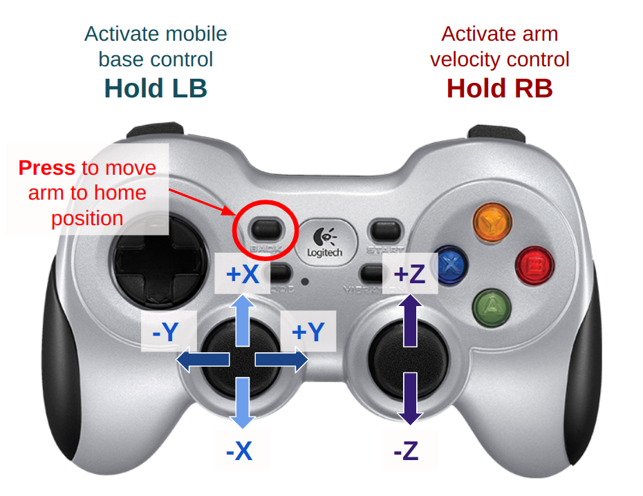
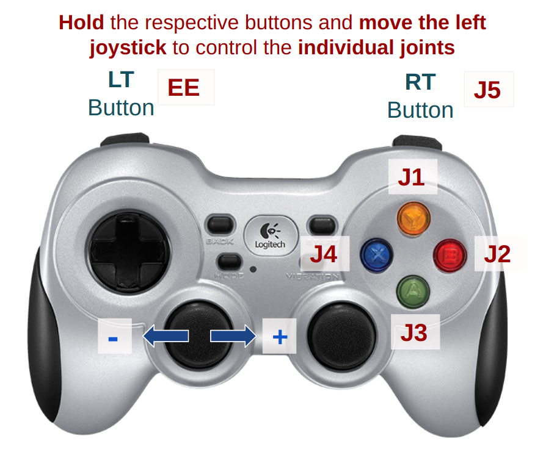

# Python Library for the Hiwonder 5-DOF Mobile Manipulator

This repository provides the python libraries for interfacing with the Hiwonder 5-DOF mobile manipulator. The robot platform has an onboard **Raspberry Pi 4B** which serves as the main compute unit of the system. The 5-DOF arm are driven by serial bus servos controlled over serial while the mobile base is driven by DC motors controlled by a custom driver board with communication over I2C.

Your project development will be done onboard the Raspberry Pi ideally over **SSH protocol**.


## Setting up the onboard Raspberry Pi

#### Step 0: Connect to Raspberry Pi over SSH
- Run `ssh funrobot@funrobot#.local` in terminal, replacing `#` with the number of your SD card.
  [Find your SD card number](https://docs.google.com/spreadsheets/d/1oiZmZgGmFAW9nbCus0FoESnCpqEN_4TZb9X0I5U4Vjc/).
  **The password is `FunR0b0!`** 
- SSH troubleshooting:
  - Make sure you are connected to the Olin Robotics network (It should work on Olin, but Olin Robotics may be faster/more stable).
  - Make sure OpenSSH Client and OpenSSH Server are installed (should be installed by default on Mac/Linux, may need to be installed under `Settings > System > Optional Features` in Windows).
  - Make sure the OpenSSH folder is added to your path. Should be `C:\Windows\System32\OpenSSH` in Windows.
  - Check the SD card to make sure the number physically written on it matches what you expect.

#### Step 1: Create a virtual environment
- We strongly recommend that you create a new python virtual environment for all your work on the platform.
- Follow this [tutorial here](https://docs.python.org/3/tutorial/venv.html).


#### Step 2: Get this repository from Github
- I recommend you fork this repository to the account of one of your teammates and then you all can clone from the forked version.
- Follow [this tutorial](https://ftc-docs.firstinspires.org/en/latest/programming_resources/tutorial_specific/android_studio/fork_and_clone_github_repository/Fork-and-Clone-From-GitHub.html) to understand how to fork and clone repositories


#### Step 3: Install all required Python packages
```bash
# first: make sure you have activated the virtual environment. See step 1 tutorial

# cd to the project folder
$ cd hiwonder-armpi-pro

# install all required packages from requirements.txt
$ pip install -r requirements.txt
```


### How to Run

- Before you run any script, please initialize the **pigpiod module**
``` bash
$ sudo pigpiod
```

- If setup worked well, you should be able to run the main script with the command below:
``` bash
$ sudo venv/bin/python main.py 
# this runs the main script using admin privileges and the virtual environment's python interpreter.
# N.B.: Please make sure you set the right path for your virtual environment's python interpreter above
```

### Usage Guide

 



