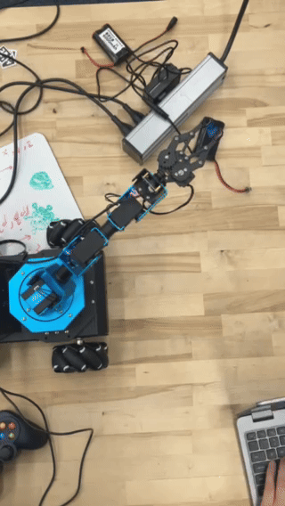
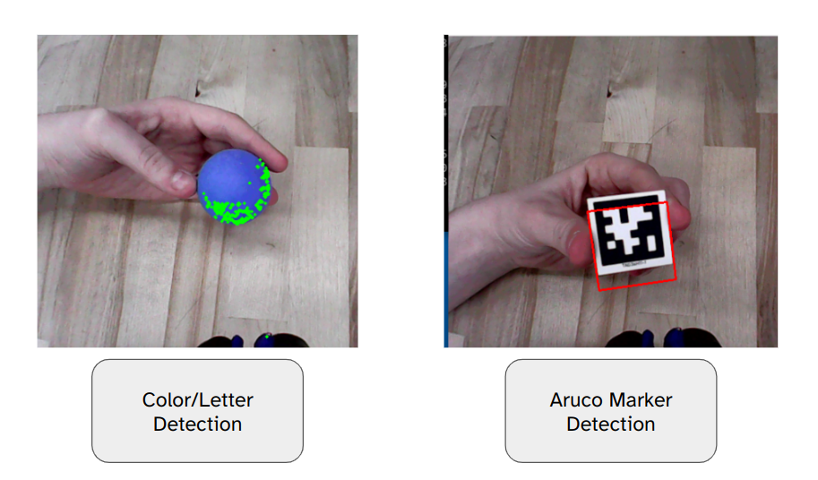
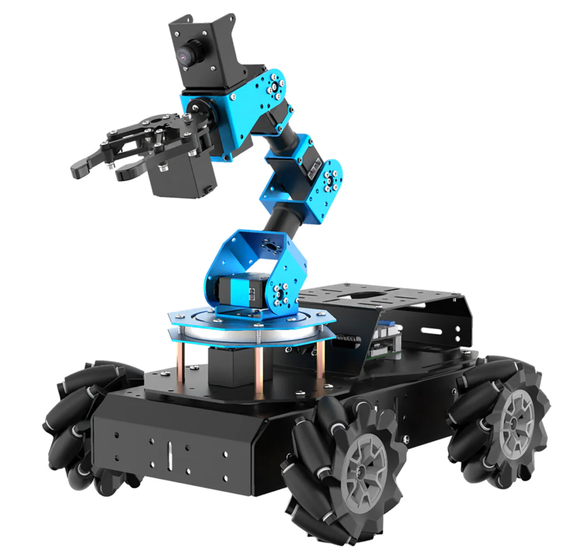
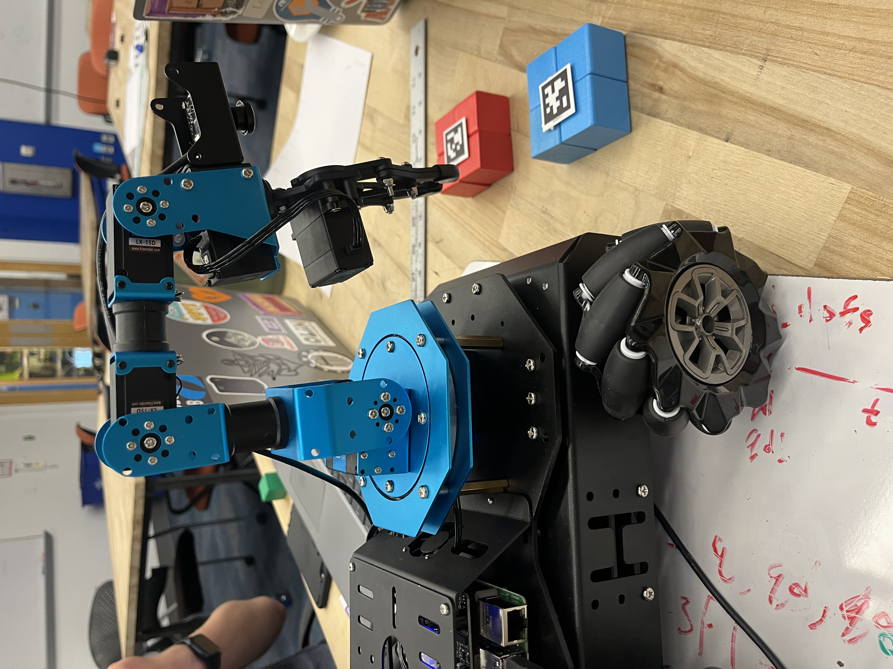

# Typerobo: A Robot that Presses Buttons for You

Typerobo is a repository that provides software for the Hiwonder 5-DOF mobile manipulator to detect colorred buttons and press them. The project consists of three key parts: numerical inverse kinematics (IK), trajectory generation, and computer vision. 

Numerical inverse kinematics is used to calculate servo joint angles given a desired cartesian 3D coordinate in the robot frame. This allows Typerobo to precisely reach desired location within ±1 cm. 

Trajectory generation is used to plan out a straight line path from the robots current location to the desired location (where the button is). We have implemented and tested the cubic quintic, or trapezoidal method which can be swapped out for each other modularly. 



We used a mixture of classical computer vision techniques and pose estimation with Aruco tags to identify the colorred buttons. The classical CV techniques segmented images based on HSV values to detect different colors identifying the buttons. We then perform pose estimation based on the Aruco tag's on the button. Using kinematics techniques, the pose (in the camera frame) is transformed into the robot frame to be used for trajectory generation.



The hardware we are using is a 5-DOF mobile manipulator provided by Hiwonder. The OS is [ask Dom].



### Demo Video

<video src="media/demo.mp4" controls></video>

## How to install/setup on Raspberry Pi

#### Step 0: Connect to Raspberry Pi over SSH
- Run `ssh pi@[robot-name].local` in terminal. (We used pippi for this project)
  **The password is `fun`** 
- SSH troubleshooting:
  - Make sure you are connected to the Olin Robotics network (It should work on Olin, but Olin Robotics may be faster/more stable).
  - Make sure OpenSSH Client and OpenSSH Server are installed (should be installed by default on Mac/Linux, may need to be installed under `Settings > System > Optional Features` in Windows).
  - Make sure the OpenSSH folder is added to your path. Should be `C:\Windows\System32\OpenSSH` in Windows.
  - Check the SD card to make sure the number physically written on it matches what you expect.


#### Step 1: Clone or fork v2025 branch of this repository
- If you are cloning, use this code
```bash
#navigate to workspace folder
$ cd [path-to-workspace-folder]

# clone the v2025 branch of the project
$ git clone -b v2025 https://github.com/titut/typerobo.git
```

#### Step 2: Create a virtual environment in typerobo directory
- We strongly recommend that you create a new python virtual environment for all your work on the platform.
- Follow this [tutorial here](https://docs.python.org/3/tutorial/venv.html).
- If you have **already installed** virtual environment and **using ubuntu**, for a simple venv set up, use this code here
```bash
# navigate to typerobo directory
$ cd typerobo

# initialize a virtual environment in the typerobo directory
$ python3 -m venv venv

# activate the virtual environment
$ source venv/bin/activate
```


#### Step 3: Install all required Python packages
```bash
# first: make sure you have activated the virtual environment. See step 2

# second: make sure you are in the typerobot directory 

# install all required packages from requirements.txt
$ pip install -r requirements.txt
```

## How to run

Before you run any script, please initialize the **pigpiod module**
``` bash
$ sudo pigpiod
```

If setup worked well, you should be able to run the main script with the command below:
``` bash
# activate the virtual environment
$ source [path-to-typerobo]/venv/bin/activate

# run the main script.
$ python3 main.py 
```

## Usage Guide

Once you have run
``` python3 main.py```, check whether the home position looks like this.



Then, in the terminal you'll see a place to input the colorred button you want typerobo to press.

```bash
$ Color: [insert-color-here]
```

The available options are "red" and "blue". **You can also input "home" to command the typerobo to return to the home position**

#### IT'S THAT SIMPLE!

## Customizable Components

There are a few parameters that you can customize in typerobo. All these changes will take place in `/scripts/hiwonder.py`.

### Trajectory Generation Method

You can select from three different trajectory generation method: cubic, quintic (default), and trapezoidal. The cubic and quintic methods are interchangeable. However, we recommend using the quintic method as that ensures continuous acceleration. The trapezoidal method allows for more flexibility in controlling the overall speed of the arm. But, because of that, it will require you to set a speed on top of the trajectory method.

To change the trajectory method go to **line 69**, and edit the variable

```python
self.trajectory_method = [insert-method-here]
# if selected "trapezoidal, you have to change this too
self.trapezoidal_speed = [insert-speed-here]
```

### Trajectory Generation Steps

Another part of the trajectory generation you can edit is the amount of steps to generate. The default value is 25. To edit this value, go to **line 71**.

```python
self.trajectory_steps = [insert-number-here]
```

NOTE: a higher steps value will increase the accuracy of the path generated. However, it will increase computational time.

### Path move time

You can also change how fast you want the arm to move towards the desired location. To do this, go to **line 72**. The time is measured in seconds.

```python
self.move_time = [insert-time-here]
```

### Home position

Lastly, you can edit the home position so that the camera angle is different. To do this, go to line **line 49**.

```python
self.home_position = [theta1, theta2, theta3, theta4, theta5, 0]
# NOTE: the sixth angle is to open and close the claw, which we won't be using in this project
```